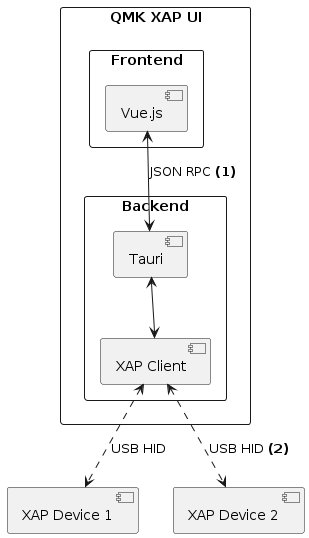

# QMK XAP Client

This repository contains the an experimental Client for the QMK Firmware [XAP protocol](https://github.com/qmk/qmk_firmware/pull/13733). It is build using the following base technologies:

* [Tauri](https://tauri.app/) as it's runtime
* [Vue.js](https://vuejs.org/) as the frontend framework
* [Quasar](https://quasar.dev/) as the ui component library
* [Rust](https://www.rust-lang.org/) for the backend
* [Typescript](https://www.typescriptlang.org/) for the frontend

## Architecture/Design



**(1) JSON RPC:**

frontend and backend communicate over remote procedure calls using JSON as it's data exchange format. These calls come in two flavors:

  * [Commands](https://tauri.app/v1/guides/features/command/): are synchronous and follow a request and response model. Only the frontend can initiate these commands and the backend responds with the help of pre-defined Command handlers. The XAP client makes heavy use of these commands to provide well defined endpoints that either query data from the attached XAP devices or run actions on these devices.
  * [Events](https://tauri.app/v1/guides/features/events/): are asynchronous and do not provide any feedback from the event listeners. Both the frontend and backend can listen to and emit events. The XAP clients backend signals state changes e.g. Newly attached devices or Removed devices to the frontend with these.

All serialization from Rust structs into JSON objects is done automatically with the help of the [Serde](https://serde.rs/) framework and it's JSON serializer implementation [serde_json](https://github.com/serde-rs/json). The structure of the JSON objects is derived from the layout of the Rust structs.

In order to keep the backend structs and frontend TS types in synchronization and automatically propagate changes in the datatype [ts-rs](https://github.com/Aleph-Alpha/ts-rs) is used to generate matching Typescript interface definitions from the Rust structs.

As an example the `RGBMatrixConfig` struct is annotated with the [`derive`](https://doc.rust-lang.org/book/appendix-03-derivable-traits.html) attribute and specifically derive serde's `Serialize` and ts-rs's `TS` Trait.

```Rust
#[derive(BinWrite, BinRead, Debug, TS, Serialize, Deserialize)]
#[ts(export)]
pub struct RGBMatrixConfig {
    pub enable: u8,
    pub mode: u8,
    pub hue: u8,
    pub sat: u8,
    pub val: u8,
    pub speed: u8,
    pub flags: u8,
}
```

With these the following Typescript Interface are automatically generated:

```Typescript
export interface RGBMatrixConfig {
    enable: number,
    mode: number,
    hue: number,
    sat: number,
    val: number,
    speed: number,
    flags: number,
}
```

...which can then directly be used in the for backend for Tauri Command and Events:

```Rust
#[tauri::command]
pub(crate) async fn rgbmatrix_config_get(
    id: Uuid,
    state: State<'_, Arc<Mutex<XAPClient>>>,
) -> XAPResult<RGBMatrixConfig> {
    state.lock().query(id, RGBMatrixConfigGet {})
}
```

and in the frontend to invoke said handler (two already wrapped in a helper function):

```Typescript
export async function getConfig(id: string): Promise<RGBMatrixConfig> {
  return await querybackend('rgbmatrix_config_get', id, null)
}
```

Both the backend and frontend handler have to be written manually at this point, but should ideally be auto generated where it makes sense e.g. whenever data is passed directly from the XAP device to the frontend. Other handlers that involve aggregation and processing of data from the XAP device at least need to be implemented by hand in the backend.

**(2) USB HID:** 

To communicate with attached XAP devices over USB RAW HID the backend uses the [hidapi-rs](https://github.com/ruabmbua/hidapi-rs) library. The client supports multiple simultaneous connected devices and distinguishes these by attaching an [UUID](https://en.wikipedia.org/wiki/Universally_unique_identifier) when opening a new device. 

The two main structs two mention here are:

* `XAPDevice` represents exactly one physically attached XAP device. Every device spawns a capturing thread that reacts to incoming responses for requests or passes broadcast messages to an event loop.
* `XAPClient` detects new XAP devices and manages existing ones. It also forwards requests to the individual devices with the help of an UUID identifier.

The parsing of the RAW XAP HID packets into Rust structs is done with the help of the [binrw](https://binrw.rs/) crate which derives C-ABI compatible binary readers and writers from the Rust struct layout or can be implemented by hand for special cases like the XAP `Token` and `String` types.

For example the `ResponseRaw` and again `RGBMatrixConfig` struct, the later is constructed by the `XAPDevice` out of the `payload` member of the `ResponseRaw` struct:

```Rust
#[binread]
#[derive(Debug)]
pub struct ResponseRaw {
    token: Token,
    flags: ResponseFlags,
    #[br(temp)]
    payload_len: u8,
    #[br(count = payload_len)]
    payload: Vec<u8>,
}

#[derive(BinWrite, BinRead, Debug, TS, Serialize, Deserialize)]
#[ts(export)]
pub struct RGBMatrixConfig {
    pub enable: u8,
    pub mode: u8,
    pub hue: u8,
    pub sat: u8,
    pub val: u8,
    pub speed: u8,
    pub flags: u8,
}
```

## Project Structure

```
.
├── public
├── src **frontend**
│  ├── assets
│  ├── commands (*(not yet) autogenerated* JSON RPC handlers - TS)
│  │  └── lighting
│  ├── layouts (base UI layout)
│  ├── pages (individual XAP subsystem as pages)
│  ├── router (routing for pages)
│  ├── stores (available XAP devices as global state)
│  └── utils
└── src-tauri **backend**
   ├── bindings (*autogenerated* JSON RPC types)
   ├── icons
   └── src
      ├── commands (*(not yet) autogenerated* JSON RPC handlers - Rust)
      │  └── lighting
      └── xap
         ├── hid (XAP Client and Device abstractions)
         └── protocol (*(not yet) autogenerated* XAP protocol handlers - Rust)
            └── subsystems
               └── lighting
```

### Design "Rules"

**General:**

* Robust error handling, errors must not bring the application into an invalid state
* Leverage types and design APIs that are hard to miss-use
* All inter-component communication must provide log/tracing messages to gain easy introspection into the system. E.g. the frontend logs if it has received a new event or issues a command - including the payload.

**The frontend:**

* Is as dumb as possible - it presents data and prepares data to be sent to the backend.
* Holds as little state as possible and rather relies on fetching data from the backend again.
* Reacts to asynchronous backend events and syncs its internal state accordingly:
  * A new device was found - add it to available devices store
  * A device was removed - remove it from available devices store
  * The secure state of a changed - update secure state of device in the devices store

**The backend:**

* Handles all low-level USB communication
* Implements and abstracts the XAP protocol
* Handles raw data aggregation and provides normalized abstractions for consumption.
  * e.g. when a new Device connects, all static information about the device is retrieved and put into the `XAPDeviceInfo` struct. The frontend works with this struct and e.g. never initiates a query to ask the device about its enabled XAP subsystems or config JSON blobs.

### Painpoints

* frontend backend barrier across different languages is an overhead in leads to code duplication (Handlers, Exchanged Data). This should be reduced as much as possible with code generation.

### Outlook

* Leverage code generation as much as possible
* The XAP protocol, client and device implementation can be compiled to WebAssembly and leverage [web_sys](`https://docs.rs/web-sys/latest/web_sys/struct.Usb.html`) crate for WebHID compatibility. This could allow a WebApp without Tauri from the same codebase in the Future(tm).
